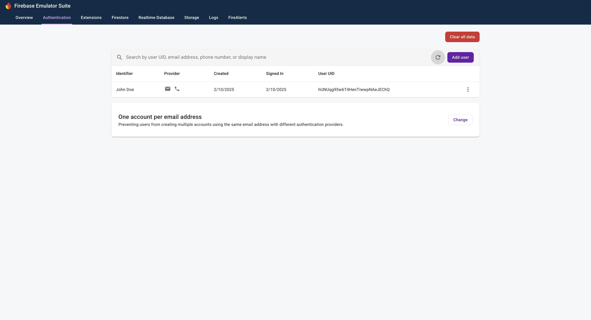
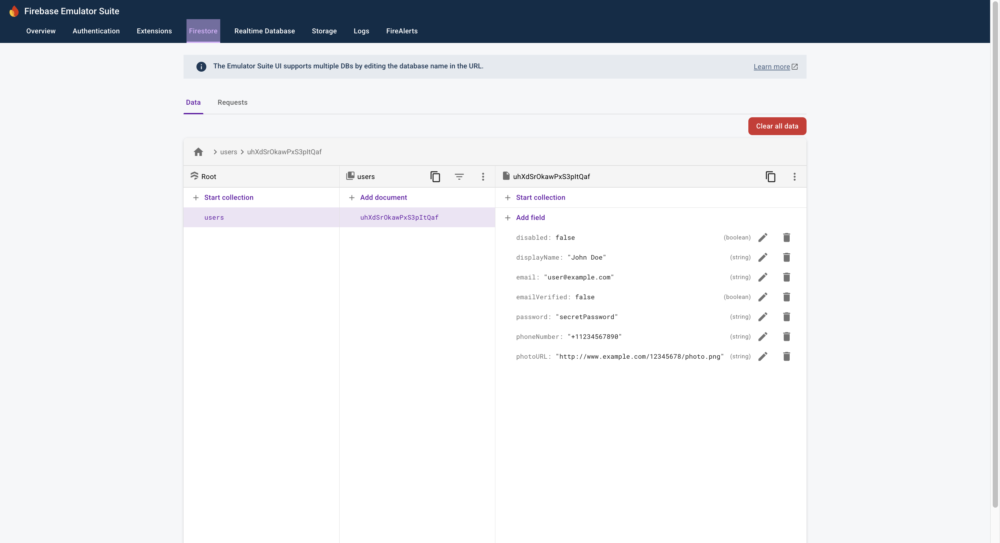

# Repro for issue 2843

## Versions

firebase-tools: v13.30.0<br>
firebase-admin: v13.1.0<br>
node: v22.13.1<br>
platform: macOS Sonoma 14.7.2

## Steps to reproduce

1. Install dependencies
   - Run `cd admin-app`
   - Run `npm i`
   - Run `cd ../`
2. Run `firebase emulators:start --project demo-project`
3. Open a new terminal
   - Run `cd admin-app`
   - Run `node dataconnect.js`
   - Errors with:

```
FirebaseAppError: Credential implementation provided to initializeApp() via the "credential" property failed to fetch a valid Google OAuth2 access token with the following error: "Could not load the default credentials. Browse to https://cloud.google.com/docs/authentication/getting-started for more information.".
    at <PATH>/issue-reports/admin-app/node_modules/firebase-admin/lib/app/firebase-app.js:87:19
    at process.processTicksAndRejections (node:internal/process/task_queues:105:5)
    at async <PATH>/issue-reports/admin-app/node_modules/firebase-admin/lib/data-connect/data-connect-api-client-internal.js:91:26
    at async main (file://<PATH>/issue-reports/admin-app/dataconnect.js:20:25) {
  errorInfo: {
    code: 'app/invalid-credential',
    message: 'Credential implementation provided to initializeApp() via the "credential" property failed to fetch a valid Google OAuth2 access token with the following error: "Could not load the default credentials. Browse to https://cloud.google.com/docs/authentication/getting-started for more information.".'
  },
  codePrefix: 'app'
}
```

## Notes

Firestore and Auth does not require credentials when connecting to the emulator

1. Run `firebase emulators:start --project demo-project`
2. Run `cd admin-app`
3. (AUTH) Run `node auth.js`
   - No errors raised
   - User created when visiting "http://127.0.0.1:4000/auth"
     
4. (FIRESTORE) Run `node firestore.js`
   - No errors raised
   - User created when visiting "http://127.0.0.1:4000/firestores"
     
